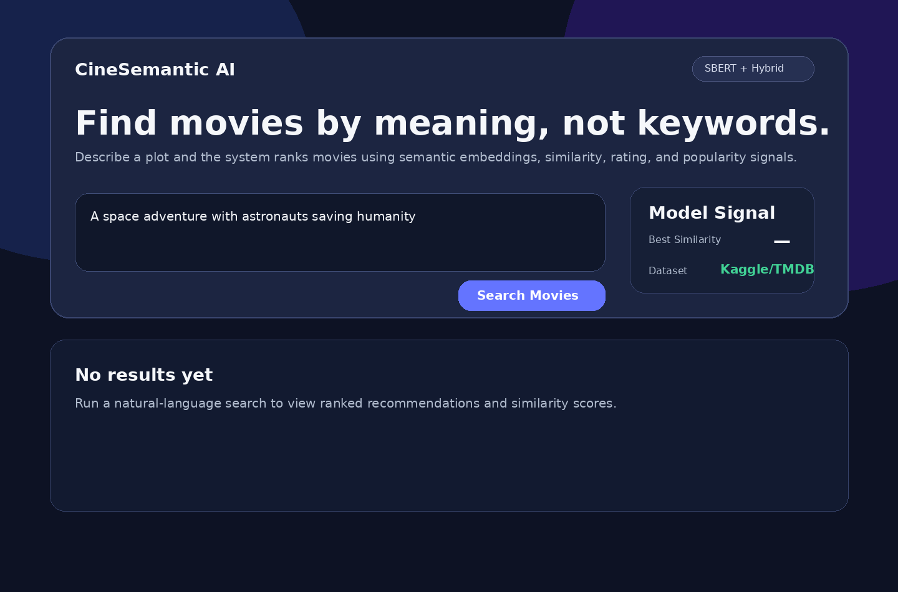
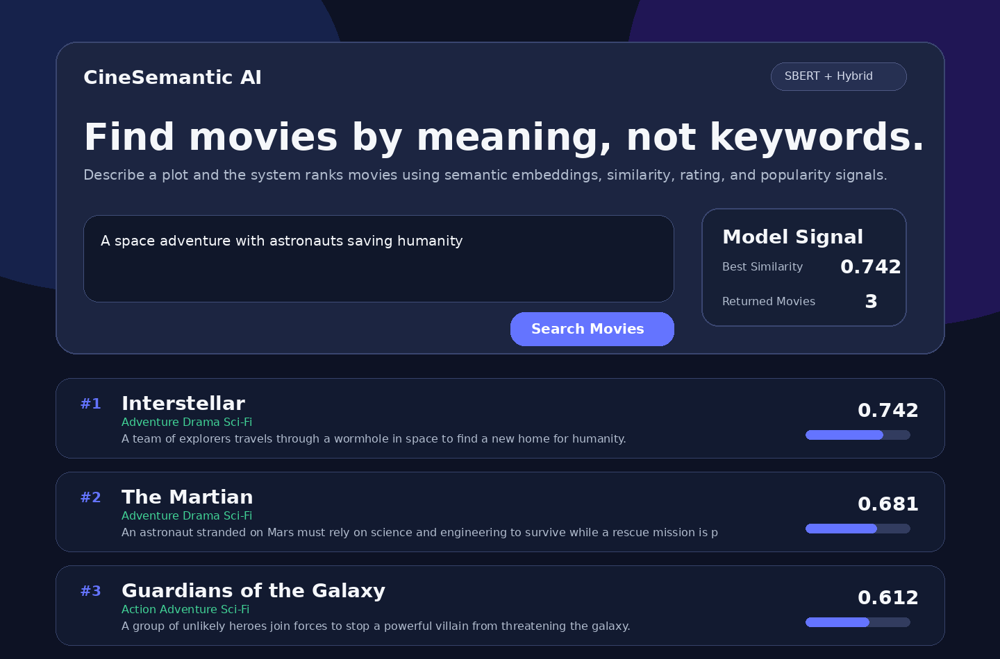
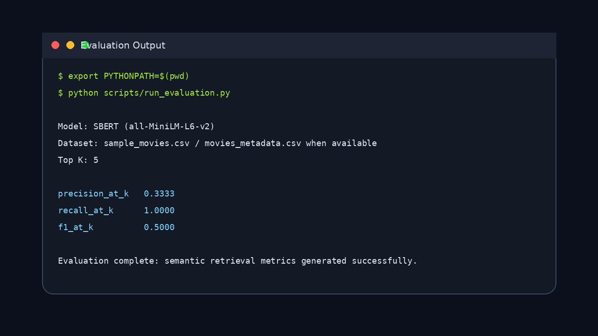
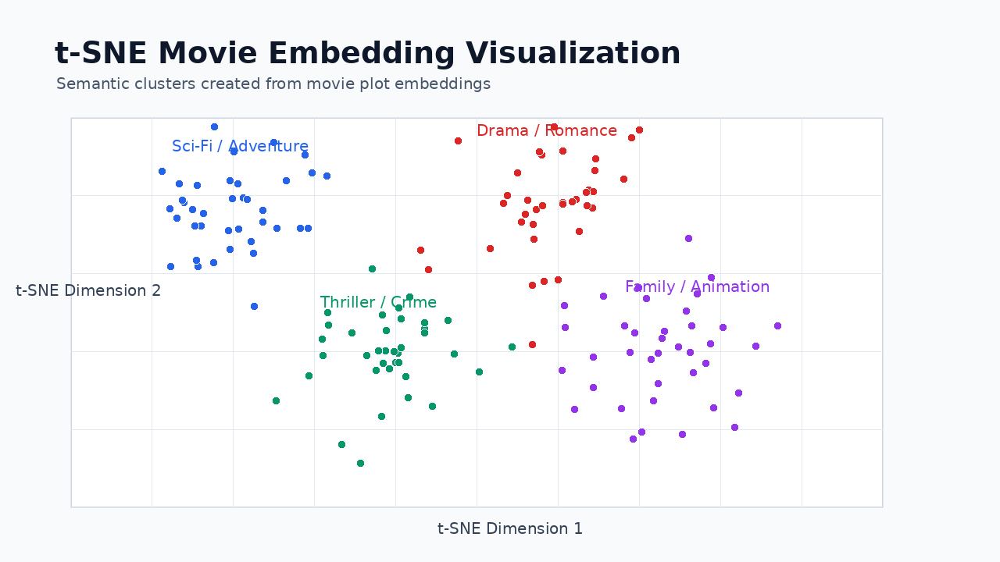

# Semantic Movie Recommendation System

A full-stack AI movie recommender that lets users search by plot meaning instead of exact keywords. The app uses SBERT embeddings, cosine similarity, and hybrid ranking with rating and popularity signals to return relevant movie recommendations.

## Preview

### Search Interface


### Recommendation Results


### Evaluation Output


### Embedding Visualization


## Features

- Natural-language movie search using SBERT embeddings
- Hybrid ranking using semantic similarity, ratings, and popularity
- React + TypeScript frontend
- Flask REST API backend
- Genre, result count, and minimum-score controls
- Precision@K, Recall@K, and F1 evaluation
- t-SNE visualization of movie embeddings
- Kaggle/TMDB dataset support with sample dataset fallback
- One-command local startup with `./dev.sh`

## Tech Stack

| Layer | Tools |
|---|---|
| Frontend | React, TypeScript, Vite |
| Backend | Python, Flask, Flask-CORS |
| AI/ML | Sentence-BERT, Scikit-Learn, cosine similarity |
| Data | Pandas, NumPy, TMDB/Kaggle metadata |
| Visualization | Matplotlib, t-SNE |

## Architecture

```text
User Query → React Frontend → Flask API → SBERT Embeddings → Cosine Similarity → Hybrid Ranking → Recommendations
```

## Run Locally

```bash
git clone https://github.com/Harikasan/semantic-movie-recommender.git
cd semantic-movie-recommender
chmod +x dev.sh
./dev.sh
```

The script starts both services:

```text
Backend:  http://127.0.0.1:5001
Frontend: http://localhost:5173
```

Manual startup is also supported:

```bash
python3 -m venv venv
source venv/bin/activate
pip install -r requirements.txt
export PYTHONPATH=$(pwd)
python -m app.api
```

In another terminal:

```bash
cd frontend
npm install
npm run dev
```

## Dataset

The project works immediately with the bundled sample dataset:

```text
data/sample_movies.csv
```

For stronger recommendations, download The Movies Dataset from Kaggle and place this file in `data/`:

```text
data/movies_metadata.csv
```

The app automatically uses `movies_metadata.csv` when present. Otherwise, it falls back to `sample_movies.csv`.

## Useful Commands

Run evaluation:

```bash
export PYTHONPATH=$(pwd)
python scripts/run_evaluation.py
```

Generate t-SNE visualization:

```bash
export PYTHONPATH=$(pwd)
python scripts/generate_tsne.py
```

Check backend health:

```bash
curl http://127.0.0.1:5001/health
```

## API Endpoints

| Method | Endpoint | Purpose |
|---|---|---|
| GET | `/health` | Backend status and dataset information |
| GET | `/genres` | Available genres |
| POST | `/search` | Natural-language semantic search |
| POST | `/recommend` | Alias for search |
| POST | `/similar` | Find movies similar to a given title |

Example request:

```bash
curl -X POST http://127.0.0.1:5001/search \
  -H "Content-Type: application/json" \
  -d '{"query":"A space adventure with astronauts saving humanity","top_k":5,"min_score":0.3}'
```

## Technical Highlights

- Implemented transformer-based semantic search using SBERT embeddings and cosine similarity.
- Added a hybrid ranking layer combining semantic relevance, rating, and popularity scores.
- Built a full-stack interface using React, TypeScript, Flask, and REST APIs.
- Added evaluation and visualization scripts to measure and inspect recommendation quality.
- Added embedding cache support to avoid recomputing vectors on repeated runs.

## LICENSE

This project is licensed under the MIT License. See the **LICENSE** file for details.
